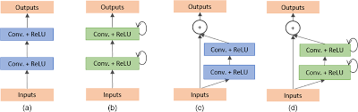

# keras_segmentation
Keras segmentation models, Attention Unet, Fusion Net, and Lane Net

Image Segmentation using neural networks (NNs), designed for extracting the road network from remote sensing imagery and it can be used in other applications labels every pixel in the image (Semantic segmentation) 

Details can be found in these papers:

* [Unet: Convolutional Networks for Biomedical Image Segmentation](https://arxiv.org/abs/1505.04597)
* [Attention U-Net: Learning Where to Look for the Pancreas](https://arxiv.org/abs/1804.03999)
* [FusionNet: A deep fully residual convolutional neural network for image segmentation in connectomics](https://arxiv.org/pdf/1612.05360)
* [Recurrent Residual Convolutional Neural Network based on U-Net (R2U-Net) for Medical Image Segmentation](https://arxiv.org/abs/1802.06955)

## Comparisson of different types of U-Net 

* (a) Basic convolutional unit in U-Net
* (b) Convolutional unint in RU-Net
* (c) Convolutional unit in Residual U-Net
* (d) Convolutional unit in R2U-Net

## Requirements
* Python 3.6
* CUDA 10.0
* Keras 2.0

## Modules
utils.py and helper.py 
functions for preprocessing data and saving it.
